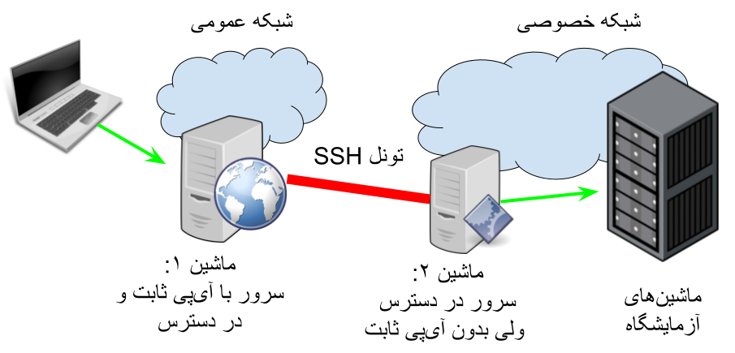

# درباره 

آموزش اتصال دو شبکه با ssh-tunnel

از این تنظیمات برای دسترسی به شبکه های محلی مانند دانشگاه می توانید استفاده کنید.

# نمای کلی کارکرد



 کاربر از طریق یک سرور در دسترس با آی‌پی مشخص به شبکه خصوصی متصل می‌شود. برای برقرار این ارتباط 
 یک ماشین با دسترسی به شبکه خصوصی یک تونل به سرور ایجاد می‌کند تا ترافیک از طریق آن به شبکه منتقل شود.
 در انتهای تونل می‌توان یک پراکسی قرار داد تا ترافیک را به سمت سرور مورد نظر انتقال دهد.
 در این کاربرد کاربر از آی‌پی سرور در شبکه عمومی برای اتصال به پروکسی در شبکه خصوصی استفاده می‌کند.

 در صورت تمایل برای دانستن جزییات بیشتر به 
 [docs/INTERNALS.md](./docs/INTERNALS.md)
 مراجعه کنید

 # نصب و راه اندازی

 روی *ماشین ۱* تنظیمات ssh زیر را انجام دهید:
 در فایل
`/etc/ssh/sshd_config`
 مقدار GatewayPorts را به yes تغییر دهید و حالت comment خارج اش کنید (و یا اگر این نام وجود ندارد به فایل اضافه کنید).
 
 
 
 سرویس ssh را ریستارت کنید (دستور زیر) تا تغییرات اثر بخش شود.
 ```bash
 sudo systemctl restart sshd.service
 ```
 
در *ماشین ۲* فایل های موجود در این ریپازیتوری را قرار دهید.
فایل `establish_rev_link.sh` اسکریپت برای ایجاد تونل است. تنظیمات مورد نیاز آن فایل ‍‍`config.sh` قرار دارد. تنظیمات را تکمیل کنید و اسکریپت را اجرا کنید.
به صورت خلاصه این اسکریپت از طریق ssh به *ماشین ۱* متصل می‌شود (اطلاعات مورد نیاز به اتصال SSH را در زیر آمده است) و ترافیک را که به یک پورت مشخص از ماشین ۱ می رسد به ماشین ۲ انتقال می‌دهد. با تنظیم کردن پروکسی سرور در *ماشین ۲* این ترافیک می‌تواند به دیگر ماشین‌های شبکه خصوصی منتقل شود.

## تنظیمات

* IFNAME_DARKSIDE: نام رابط شبکه‌ای که برای ارتباط با ماشین ۱ استفاده شود.
* IFNAME_LIGHTSIDE: نام رابط شبکه‌ای که برای ارتباط با ماشین‌های شبکه خصوصوی استفاده شود.
> درصورتی که از یک رابط (مثلا eth0) برای اتصال به هر دو شبکه استفاده می‌شود، مقدار این دو مورد می تواند یکسان باشد

* TARGET_SERVER: آدرس IP یا دامنه سرور مجازی (VPS) مقصد.
* TARGET_SERVER_USER: نام کاربری مورد نظر برای اتصال SSH به سرور مقصد.
* TARGET_SERVER_SSH_PORT: پورت مورد استفاده برای برقراری ارتباط SSH (معمولاً ۲۲).
* TARGET_SERVER_SSH_PRIVATE_KEY: مسیر فایل کلید خصوصی SSH برای احراز هویت بدون رمز عبور.
> اگر می‌خواهید با رمز عبور متصل شوید مقدار این مورد ار خالی قرار دهید
* TARGET_SERVER_FORWARD_PORT: پورتی روی سرور مقصد که ترافیک به آن هدایت (Forward) می‌شود.
* LOCAL_LISTEN_PORT: پورتی روی گیت‌وی محلی که برای دریافت ترافیک ورودی گوش می‌دهد.

## پروکسی

بعد از اجرای اسکریپت یک تونل ایجاد شده است که ترافیک ورودی به ماشین ۱ از پورت ‍‍`TARGET_SERVER_FORWARD_PORT` را به ماشین ۲ در پورت ‍`LOCAL_LISTEN_PORT` منتقل می‌کند.
کافی است یک پروکسی (HTTP proxy یا موارد دیگر) ترافیک ورودی به `LOCAL_LISTEN_PORT` ماشین ۲ را دریافت کند و دسترسی را ایجاد کند. 

> نکته مهم این است که پروکسی را در داخل network namespace ایجاد شده با پروکسی اجرا کنید. برای جزییات [docs/INTERNALS.md](./docs/INTERNALS.md)  را مطالعه کنید

